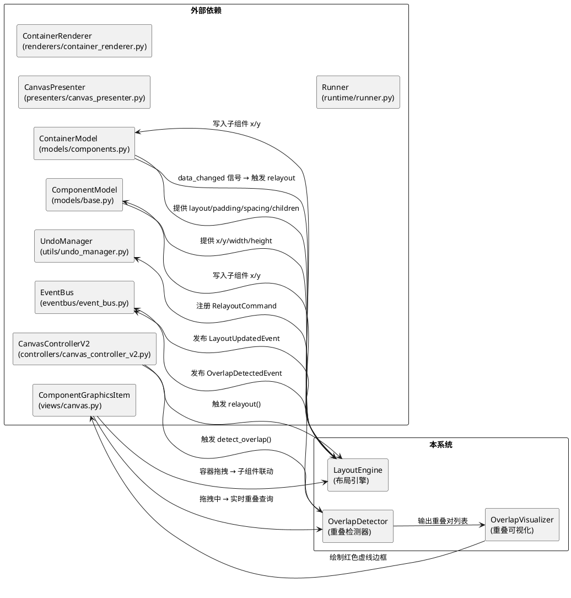

# **1. 实现模型**

## **1.1 上下文视图**

### 系统上下文关系



### 现有架构关键信息

| 模块 | 文件路径 | 关键接口/类 | 与布局引擎的交互方式 |
|------|----------|-------------|---------------------|
| 数据层 | `models/components.py` | `ContainerModel` (layout, padding, spacing, children) | 布局引擎读取属性、写入子组件 x/y |
| 数据层 | `models/base.py` | `ComponentModel` (x, y, width, height, position_changed) | 位置变更触发 data_changed 信号 |
| 视图层 | `views/canvas.py` | `ComponentGraphicsItem` (拖拽/resize/父子关系) | 拖拽中实时重叠检测；拖拽结束触发布局重排 |
| 视图层 | `views/canvas.py` | `DesignerView` (add_component_item) | 子组件增删触发布局重排 |
| 控制层 | `controllers/canvas_controller_v2.py` | `CanvasControllerV2` (DragState/ResizeState) | 拖拽结束/resize结束 → 调用布局引擎 |
| 中介层 | `presenters/canvas_presenter.py` | `CanvasPresenter` (EventBus桥接) | 桥接布局事件到EventBus |
| 渲染层 | `renderers/container_renderer.py` | `ContainerRenderer` | 重叠视觉叠加绘制 |
| 事件层 | `eventbus/event_bus.py` | `EventBus` (component_moved/resized) | 新增 layout_updated / overlap_detected 信号 |
| 撤销层 | `utils/undo_manager.py` | `UndoManager` (push) | 布局重排产生的位置变更注册撤销 |
| 运行时 | `runtime/runner.py` | `Runner` (_calculate_relative_position) | 运行时由布局引擎控制位置，不直接跟随拖拽 |

## **1.2 服务/组件总体架构**

```plantuml
@startuml
package "services/layout/" as layout {
    class LayoutEngine {
        - _strategies: Dict[str, LayoutStrategy]
        - _project_model: ProjectModel
        + relayout(container: ContainerModel) LayoutResult
        + on_container_changed(container_id: str) void
        + on_children_changed(container_id: str) void
        + on_container_resized(container_id: str) void
        + move_children_with_parent(container_id: str, dx: int, dy: int) void
    }

    class LayoutStrategy <<interface>> {
        + calculate(children: List[ComponentModel], content_area: Rect, spacing: int) Dict[str, Tuple[int,int]]
    }

    class VerticalLayoutStrategy {
        + calculate(...) Dict[str, Tuple[int,int]]
    }

    class HorizontalLayoutStrategy {
        + calculate(...) Dict[str, Tuple[int,int]]
    }

    class GridLayoutStrategy {
        + calculate(...) Dict[str, Tuple[int,int]]
    }

    class NoneLayoutStrategy {
        + calculate(...) Dict[str, Tuple[int,int]]
    }
}

package "services/layout/" as overlap {
    class OverlapDetector {
        + detect(source: ComponentModel, siblings: List[ComponentModel]) List[OverlapInfo]
        + detect_all(container: ContainerModel, children: List[ComponentModel]) List[Tuple[str,str]]
    }

    class OverlapVisualizer {
        - _overlap_items: Dict[str, QGraphicsRectItem]
        + show_overlaps(overlaps: List[Tuple[str,str]], canvas_view: DesignerView) void
        + clear_overlaps() void
    }

    class OverlapAvoider {
        + avoid(source: ComponentModel, overlaps: List[OverlapInfo], layout: str, spacing: int) Dict[str, Tuple[int,int]]
    }
}

package "data/" as data {
    class LayoutResult {
        + positions: Dict[str, Tuple[int,int]]
        + overlaps: List[Tuple[str,str]]
        + overflow: bool
        + content_area: Tuple[int,int,int,int]
    }

    class OverlapInfo {
        + source_id: str
        + target_id: str
        + intersection_rect: Tuple[int,int,int,int]
        + avoidance_position: Optional[Tuple[int,int]]
    }
}

LayoutEngine --> LayoutStrategy : 使用策略模式
LayoutEngine --> LayoutResult : 返回
LayoutEngine --> OverlapDetector : 委托重叠检测
OverlapDetector --> OverlapInfo : 返回
OverlapDetector --> OverlapAvoider : 委托避让
OverlapVisualizer --> OverlapInfo : 可视化
VerticalLayoutStrategy ..|> LayoutStrategy
HorizontalLayoutStrategy ..|> LayoutStrategy
GridLayoutStrategy ..|> LayoutStrategy
NoneLayoutStrategy ..|> LayoutStrategy
@enduml
```



### 类职责说明

| 类名 | 职责 | 与现有代码的集成点 |
|------|------|-------------------|
| **LayoutEngine** | 布局引擎主入口，协调策略选择、重排执行、Undo注册 | `ContainerModel.data_changed` → 触发 `on_container_changed`；`CanvasControllerV2.on_drag_end` → 触发重排 |
| **LayoutStrategy** | 布局策略接口，定义统一的 `calculate` 契约 | — |
| **VerticalLayoutStrategy** | 垂直布局：子组件从上到下排列 | — |
| **HorizontalLayoutStrategy** | 水平布局：子组件从左到右排列 | — |
| **GridLayoutStrategy** | 网格布局：均匀网格，列数自动计算 | — |
| **NoneLayoutStrategy** | 绝对定位：不修改子组件位置 | — |
| **OverlapDetector** | 重叠检测：计算矩形交集，返回重叠对 | `ComponentGraphicsItem.mouseMoveEvent` → 实时调用 |
| **OverlapVisualizer** | 重叠可视化：在重叠组件上绘制红色虚线边框 | `ContainerRenderer.render` 中叠加绘制 |
| **OverlapAvoider** | 自动避让：沿布局方向推动重叠组件到空位 | `CanvasControllerV2.on_drag_end` → 调用 |
| **LayoutResult** | 布局计算结果数据结构 | — |
| **OverlapInfo** | 重叠信息数据结构 | — |

## **1.3 实现设计文档**

### 1.3.1 LayoutEngine 详细设计

```python
class LayoutEngine:
    """布局引擎 - 容器布局排列的核心执行器。"""

    VALID_LAYOUTS = {"none", "vertical", "horizontal", "grid"}

    def __init__(self, project_model: ProjectModel, undo_manager: UndoManager):
        self._project_model = project_model
        self._undo_manager = undo_manager
        self._overlap_detector = OverlapDetector()
        self._overlap_avoider = OverlapAvoider()
        self._strategies: Dict[str, LayoutStrategy] = {
            "none": NoneLayoutStrategy(),
            "vertical": VerticalLayoutStrategy(),
            "horizontal": HorizontalLayoutStrategy(),
            "grid": GridLayoutStrategy(),
        }

    def relayout(self, container: ContainerModel) -> LayoutResult:
        """对指定容器执行完整布局重排。

        触发时机：
        1. 容器 layout/padding/spacing 属性变更
        2. 子组件增删
        3. 容器 width/height 变更且 layout != "none"
        """
        # 1. 验证 layout 值合法性
        layout = container.layout
        if layout not in self.VALID_LAYOUTS:
            layout = "none"  # 回退为绝对定位

        # 2. 计算内容区域
        content_area = self._calc_content_area(container)

        # 3. 获取子组件模型列表
        children = self._get_children_models(container)
        if not children:
            return LayoutResult(positions={}, overlaps=[], overflow=False, content_area=content_area)

        # 4. 选择策略并计算位置
        strategy = self._strategies[layout]
        new_positions = strategy.calculate(children, content_area, container.spacing)

        # 5. 检测是否溢出
        overflow = self._check_overflow(children, new_positions, content_area)

        # 6. 批量更新子组件位置（通过 UndoManager 注册撤销）
        self._apply_positions(container, children, new_positions)

        # 7. 检测重叠
        overlaps = self._overlap_detector.detect_all(container, children)

        return LayoutResult(
            positions=new_positions,
            overlaps=overlaps,
            overflow=overflow,
            content_area=content_area
        )

    def _calc_content_area(self, container: ContainerModel) -> Tuple[int,int,int,int]:
        """计算容器内容区域：(x, y, width, height)。"""
        return (
            container.x + container.padding,
            container.y + container.padding,
            container.width - 2 * container.padding,
            container.height - 2 * container.padding
        )

    def _get_children_models(self, container: ContainerModel) -> List[ComponentModel]:
        """根据 children ID 列表获取子组件模型。"""
        return [
            self._project_model.get_component_by_id(cid)
            for cid in container.children
            if self._project_model.get_component_by_id(cid) is not None
        ]

    def _apply_positions(self, container, children, new_positions):
        """批量应用位置变更，注册撤销命令。"""
        old_positions = {child.id: (child.x, child.y) for child in children}
        # 阻塞信号批量写入
        for child in children:
            if child.id in new_positions:
                new_x, new_y = new_positions[child.id]
                child.blockSignals(True)
                child.x = new_x
                child.y = new_y
                child.blockSignals(False)
        # 一次性触发 data_changed
        container.data_changed.emit()
        # 注册撤销
        self._register_undo(container.id, old_positions, new_positions)

    def move_children_with_parent(self, container_id: str, dx: int, dy: int):
        """父容器拖拽时，子组件联动移动。

        仅在编辑器模式下生效，运行时由布局引擎控制。
        不修改子组件相对父容器的偏移量。
        """
        container = self._project_model.get_component_by_id(container_id)
        if not container or not isinstance(container, ContainerModel):
            return
        for child_id in container.children:
            child = self._project_model.get_component_by_id(child_id)
            if child and not getattr(child, '_locked', False):
                child.x = child.x + dx
                child.y = child.y + dy
```

### 1.3.2 LayoutStrategy 策略详细设计

**VerticalLayoutStrategy**：

```python
class VerticalLayoutStrategy(LayoutStrategy):
    def calculate(self, children, content_area, spacing):
        """垂直布局计算。

        规则：子组件按添加顺序从上到下排列，
        第一个子组件的顶部对齐内容区域顶部，
        后续子组件顶部 = 前一个子组件底部 + spacing，
        所有子组件左侧对齐内容区域左侧。
        """
        cx, cy, cw, ch = content_area
        positions = {}
        current_y = cy

        for child in children:
            positions[child.id] = (cx, current_y)
            current_y += child.height + spacing

        return positions
```

**HorizontalLayoutStrategy**：

```python
class HorizontalLayoutStrategy(LayoutStrategy):
    def calculate(self, children, content_area, spacing):
        """水平布局计算。

        规则：子组件按添加顺序从左到右排列，
        第一个子组件的左侧对齐内容区域左侧，
        后续子组件左侧 = 前一个子组件右侧 + spacing，
        所有子组件顶部对齐内容区域顶部。
        """
        cx, cy, cw, ch = content_area
        positions = {}
        current_x = cx

        for child in children:
            positions[child.id] = (current_x, cy)
            current_x += child.width + spacing

        return positions
```

**GridLayoutStrategy**：

```python
class GridLayoutStrategy(LayoutStrategy):
    MIN_COLUMN_WIDTH = 120  # 最小列宽

    def calculate(self, children, content_area, spacing):
        """网格布局计算。

        规则：列数 = floor((cw + spacing) / (MIN_COLUMN_WIDTH + spacing))，
        子组件按行优先顺序填入网格。
        """
        cx, cy, cw, ch = content_area
        num_cols = max(1, int((cw + spacing) / (self.MIN_COLUMN_WIDTH + spacing)))

        positions = {}
        current_x = cx
        current_y = cy
        row_max_height = 0

        for i, child in enumerate(children):
            col = i % num_cols
            if col == 0 and i > 0:
                current_x = cx
                current_y += row_max_height + spacing
                row_max_height = 0

            positions[child.id] = (current_x, current_y)
            row_max_height = max(row_max_height, child.height)
            current_x += child.width + spacing

        return positions
```

**NoneLayoutStrategy**：

```python
class NoneLayoutStrategy(LayoutStrategy):
    def calculate(self, children, content_area, spacing):
        """绝对定位：保持子组件现有位置不变。"""
        return {child.id: (child.x, child.y) for child in children}
```

### 1.3.3 OverlapDetector 详细设计

```python
class OverlapDetector:
    """重叠检测器 - 检测同容器内子组件的边界矩形交集。"""

    def detect(self, source: ComponentModel, siblings: List[ComponentModel]) -> List[OverlapInfo]:
        """检测被拖组件与兄弟组件的重叠。

        用于拖拽过程中实时检测，单次只检测 source 与其他组件。
        """
        overlaps = []
        source_rect = QRectF(source.x, source.y, source.width, source.height)

        for sibling in siblings:
            if sibling.id == source.id:
                continue
            if sibling.width == 0 or sibling.height == 0:
                continue  # 零尺寸组件不触发重叠检测

            sibling_rect = QRectF(sibling.x, sibling.y, sibling.width, sibling.height)
            intersection = source_rect.intersected(sibling_rect)

            if intersection.width() > 0 and intersection.height() > 0:
                overlaps.append(OverlapInfo(
                    source_id=source.id,
                    target_id=sibling.id,
                    intersection_rect=(
                        int(intersection.x()), int(intersection.y()),
                        int(intersection.width()), int(intersection.height())
                    ),
                    avoidance_position=None
                ))

        return overlaps

    def detect_all(self, container: ContainerModel, children: List[ComponentModel]) -> List[Tuple[str, str]]:
        """检测容器内所有组件对的重叠（用于重排后全量检测）。

        返回重叠对列表 [(comp_id_a, comp_id_b), ...]。
        """
        overlap_pairs = []
        for i in range(len(children)):
            for j in range(i + 1, len(children)):
                a, b = children[i], children[j]
                if a.width == 0 or a.height == 0 or b.width == 0 or b.height == 0:
                    continue
                rect_a = QRectF(a.x, a.y, a.width, a.height)
                rect_b = QRectF(b.x, b.y, b.width, b.height)
                inter = rect_a.intersected(rect_b)
                if inter.width() > 0 and inter.height() > 0:
                    overlap_pairs.append((a.id, b.id))
        return overlap_pairs
```

### 1.3.4 OverlapVisualizer 详细设计

```python
class OverlapVisualizer:
    """重叠可视化 - 在重叠组件上绘制红色虚线边框。"""

    OVERLAP_PEN = QPen(QColor("#FF0000"), 2, Qt.PenStyle.DashLine)

    def __init__(self):
        self._overlap_items: Dict[str, QGraphicsRectItem] = {}

    def show_overlaps(self, overlap_ids: Set[str], canvas_view: DesignerView):
        """为重叠组件显示红色虚线边框。

        Args:
            overlap_ids: 处于重叠状态的所有组件ID集合
            canvas_view: 画布视图，用于获取 ComponentGraphicsItem
        """
        # 先清除不再重叠的提示
        for comp_id in list(self._overlap_items.keys()):
            if comp_id not in overlap_ids:
                self._remove_overlap_indicator(comp_id)

        # 为新重叠的组件添加提示
        for comp_id in overlap_ids:
            if comp_id not in self._overlap_items:
                item = canvas_view.get_item(comp_id)
                if item:
                    self._add_overlap_indicator(comp_id, item)

    def clear_overlaps(self):
        """清除所有重叠视觉提示。"""
        for comp_id in list(self._overlap_items.keys()):
            self._remove_overlap_indicator(comp_id)

    def _add_overlap_indicator(self, comp_id: str, item: ComponentGraphicsItem):
        """为指定组件添加重叠指示器（红色虚线矩形叠加层）。"""
        overlay_rect = QGraphicsRectItem(item.boundingRect(), item)
        overlay_rect.setPen(self.OVERLAP_PEN)
        overlay_rect.setBrush(Qt.BrushStyle.NoBrush)
        overlay_rect.setZValue(100)  # 确保在最上层
        self._overlap_items[comp_id] = overlay_rect

    def _remove_overlap_indicator(self, comp_id: str):
        """移除指定组件的重叠指示器。"""
        if comp_id in self._overlap_items:
            item = self._overlap_items.pop(comp_id)
            scene = item.scene()
            if scene:
                scene.removeItem(item)
```

### 1.3.5 OverlapAvoider 详细设计

```python
class OverlapAvoider:
    """自动避让 - 将重叠组件沿布局方向推动到最近空位。"""

    MAX_CASCADE = 20  # 级联避让最大深度
    CASCADE_WARNING_THRESHOLD = 20

    def avoid(self, source: ComponentModel, overlaps: List[OverlapInfo],
              layout: str, spacing: int, container: ContainerModel) -> Dict[str, Tuple[int, int]]:
        """计算避让位置。

        layout=none 时不执行自动避让，仅返回空字典。
        避让方向：vertical→向下推，horizontal→向右推，grid→向右优先。

        返回：{comp_id: (new_x, new_y)} 所有需要移动的组件的新位置。
        """
        if layout == "none" or not overlaps:
            return {}

        moves = {}
        cascade_count = 0

        for overlap in overlaps:
            target = self._get_component(overlap.target_id)
            if not target:
                continue

            if layout == "vertical":
                new_y = source.y + source.height + spacing
                moves[target.id] = (target.x, new_y)
            elif layout == "horizontal":
                new_x = source.x + source.width + spacing
                moves[target.id] = (new_x, target.y)
            elif layout == "grid":
                # 向右优先，空间不足则向下
                new_x = source.x + source.width + spacing
                if new_x + target.width <= container.x + container.width:
                    moves[target.id] = (new_x, target.y)
                else:
                    new_y = source.y + source.height + spacing
                    moves[target.id] = (source.x, new_y)

            cascade_count += 1
            if cascade_count >= self.CASCADE_WARNING_THRESHOLD:
                import logging
                logging.warning(f"级联避让链过长: {cascade_count} 个组件")

        return moves
```

### 1.3.6 集成点设计

#### 集成点 1：ContainerModel.data_changed → LayoutEngine

```
ContainerModel.layout setter → data_changed.emit()
                         ↓
              CanvasPresenter 监听 data_changed
                         ↓
              调用 LayoutEngine.relayout(container)
                         ↓
              LayoutResult → 更新子组件 x/y → EventBus
```

**集成方式**：在 `CanvasPresenter._connect_component_signals()` 中增加对 `ContainerModel.data_changed` 的监听，当容器属性变更时调用 `LayoutEngine.relayout()`。

#### 集成点 2：CanvasControllerV2.on_drag_end → 重叠检测 + 避让

```
CanvasControllerV2.on_drag_end()
    ↓
获取被拖组件的 parent container
    ↓
OverlapDetector.detect(source, siblings) → overlaps
    ↓
if overlaps and auto_avoid_enabled:
    OverlapAvoider.avoid(source, overlaps, layout, spacing) → moves
    LayoutEngine._apply_positions(container, children, moves)
    ↓
OverlapVisualizer.clear_overlaps()
```

**集成方式**：在 `CanvasControllerV2.on_drag_end()` 方法末尾增加重叠检测和避让逻辑。

#### 集成点 3：ComponentGraphicsItem.mouseMoveEvent → 实时重叠检测

```
ComponentGraphicsItem.mouseMoveEvent()
    ↓ (拖拽中)
获取 parent container 的 children
    ↓
OverlapDetector.detect(dragged_comp, siblings) → overlaps
    ↓
OverlapVisualizer.show_overlaps(overlap_ids, canvas_view)
```

**集成方式**：在 `ComponentGraphicsItem.mouseMoveEvent()` 拖拽分支中增加实时重叠检测调用。

#### 集成点 4：容器 resize → 重排

```
ComponentGraphicsItem.mouseReleaseEvent() (resize 结束)
    ↓
if model.type == "container" and layout != "none":
    LayoutEngine.on_container_resized(container_id)
        ↓
    LayoutEngine.relayout(container)
```

**集成方式**：在 `ComponentGraphicsItem.mouseReleaseEvent()` 的 resize 结束分支中，检测到容器类型时触发布局重排。

#### 集成点 5：父容器拖拽 → 子组件联动

```
ComponentGraphicsItem.mouseMoveEvent() (容器拖拽)
    ↓
if model.type == "container" and is_dragging:
    LayoutEngine.move_children_with_parent(container_id, dx, dy)
```

**集成方式**：在 `ComponentGraphicsItem.mouseMoveEvent()` 的拖拽分支中，当拖拽对象是容器时，计算移动增量并调用联动方法。

#### 集成点 6：EventBus 新增信号

在 `EventBus` 类中新增两个信号：
- `layout_updated = Signal(LayoutUpdatedEvent)` — 布局重排完成
- `overlap_detected = Signal(OverlapDetectedEvent)` — 重叠状态变化

#### 集成点 7：运行时 Runner 不直接跟随拖拽

在 `Runner._calculate_relative_position()` 中，当容器 layout != "none" 时，调用 `LayoutEngine.relayout()` 计算子组件位置，而非直接使用组件的 x/y 属性。

# **2. 接口设计**

## **2.1 总体设计**

布局引擎对外暴露的核心接口分为三类：

1. **布局重排接口**：由 CanvasPresenter / CanvasControllerV2 调用，响应属性变更和子组件增删
2. **重叠检测接口**：由 ComponentGraphicsItem 拖拽事件调用，提供实时反馈
3. **联动移动接口**：由 ComponentGraphicsItem 拖拽事件调用，实现父容器拖拽子组件跟随

所有接口均基于纯数据模型（ComponentModel / ContainerModel），不直接操作视图对象，遵循 MVC 分层原则。

## **2.2 接口清单**

### LayoutEngine 接口

| 方法签名 | 输入 | 输出 | 触发场景 | 性能要求 |
|----------|------|------|----------|----------|
| `relayout(container: ContainerModel) → LayoutResult` | 容器模型 | 布局计算结果 | 属性变更/子组件增删/容器resize | ≤16ms |
| `on_container_changed(container_id: str) → void` | 容器ID | 无 | ContainerModel.data_changed | ≤16ms |
| `on_children_changed(container_id: str) → void` | 容器ID | 无 | 子组件增删 | ≤16ms |
| `on_container_resized(container_id: str) → void` | 容器ID | 无 | 容器width/height变更 | ≤16ms |
| `move_children_with_parent(container_id: str, dx: int, dy: int) → void` | 容器ID, 增量 | 无 | 父容器拖拽 | ≤8ms |

### LayoutStrategy 接口

| 方法签名 | 输入 | 输出 | 说明 |
|----------|------|------|------|
| `calculate(children: List[ComponentModel], content_area: Tuple[int,int,int,int], spacing: int) → Dict[str, Tuple[int,int]]` | 子组件列表, 内容区域, 间距 | {comp_id: (x, y)} | 各布局模式的具体计算逻辑 |

### OverlapDetector 接口

| 方法签名 | 输入 | 输出 | 触发场景 | 性能要求 |
|----------|------|------|----------|----------|
| `detect(source: ComponentModel, siblings: List[ComponentModel]) → List[OverlapInfo]` | 被拖组件, 兄弟组件 | 重叠信息列表 | 拖拽中实时检测 | ≤8ms |
| `detect_all(container: ContainerModel, children: List[ComponentModel]) → List[Tuple[str,str]]` | 容器, 子组件 | 重叠对列表 | 重排后全量检测 | ≤8ms |

### OverlapVisualizer 接口

| 方法签名 | 输入 | 输出 | 说明 |
|----------|------|------|------|
| `show_overlaps(overlap_ids: Set[str], canvas_view: DesignerView) → void` | 重叠组件ID集合, 画布视图 | 无 | 显示红色虚线边框 |
| `clear_overlaps() → void` | 无 | 无 | 清除所有重叠提示 |

### OverlapAvoider 接口

| 方法签名 | 输入 | 输出 | 说明 |
|----------|------|------|------|
| `avoid(source: ComponentModel, overlaps: List[OverlapInfo], layout: str, spacing: int, container: ContainerModel) → Dict[str, Tuple[int,int]]` | 被拖组件, 重叠信息, 布局模式, 间距, 容器 | {comp_id: (new_x, new_y)} | 计算避让位置 |

# **4. 数据模型**

## **4.1 设计目标**

1. **LayoutResult**：封装布局引擎一次重排的完整输出，包括子组件位置、重叠状态、溢出状态和内容区域
2. **OverlapInfo**：封装两个组件之间的重叠信息，包括交集矩形和避让位置
3. **LayoutUpdatedEvent**：EventBus 事件，通知布局重排完成
4. **OverlapDetectedEvent**：EventBus 事件，通知重叠状态变化
5. 所有数据模型使用类型注解，确保类型安全

## **4.2 模型实现**

### LayoutResult

```python
@dataclass
class LayoutResult:
    """布局计算结果。"""

    positions: Dict[str, Tuple[int, int]]
    """子组件位置映射，key 为子组件 ID，value 为 (x, y) 坐标元组。"""

    overlaps: List[Tuple[str, str]]
    """重叠对列表，每项为两个重叠子组件 ID 的元组 (comp_id_a, comp_id_b)。"""

    overflow: bool
    """子组件是否溢出容器内容区域。"""

    content_area: Tuple[int, int, int, int]
    """容器内容区域矩形 (x, y, width, height)。"""
```

### OverlapInfo

```python
@dataclass
class OverlapInfo:
    """重叠信息。"""

    source_id: str
    """被拖拽组件的 ID，必填。"""

    target_id: str
    """重叠对方组件的 ID，必填。"""

    intersection_rect: Tuple[int, int, int, int]
    """交集矩形 (x, y, width, height)，width > 0 且 height > 0。"""

    avoidance_position: Optional[Tuple[int, int]]
    """避让后组件的目标坐标 (x, y)，可选。"""
```

### LayoutUpdatedEvent

```python
class LayoutUpdatedEvent:
    """布局重排完成事件。"""

    def __init__(self, container_id: str, result: LayoutResult):
        self.container_id = container_id
        self.result = result
```

### OverlapDetectedEvent

```python
class OverlapDetectedEvent:
    """重叠检测状态变化事件。"""

    def __init__(self, container_id: str, overlap_ids: Set[str]):
        self.container_id = container_id
        self.overlap_ids = overlap_ids
```

### RelayoutCommand（UndoManager 集成）

```python
class RelayoutCommand:
    """布局重排撤销/重做命令。"""

    def __init__(self, project_model: ProjectModel,
                 old_positions: Dict[str, Tuple[int, int]],
                 new_positions: Dict[str, Tuple[int, int]]):
        self._project_model = project_model
        self._old_positions = old_positions
        self._new_positions = new_positions

    def execute(self):
        for comp_id, (x, y) in self._new_positions.items():
            comp = self._project_model.get_component_by_id(comp_id)
            if comp:
                comp.x, comp.y = x, y

    def undo(self):
        for comp_id, (x, y) in self._old_positions.items():
            comp = self._project_model.get_component_by_id(comp_id)
            if comp:
                comp.x, comp.y = x, y
```

---

# **5. 文件变更清单与实施步骤**

## **5.1 新增文件**

| 文件路径 | 说明 |
|----------|------|
| `services/layout/__init__.py` | 布局引擎包初始化 |
| `services/layout/layout_engine.py` | LayoutEngine 主类 |
| `services/layout/layout_strategy.py` | LayoutStrategy 接口及四种策略实现 |
| `services/layout/overlap_detector.py` | OverlapDetector 类 |
| `services/layout/overlap_visualizer.py` | OverlapVisualizer 类 |
| `services/layout/overlap_avoider.py` | OverlapAvoider 类 |
| `services/layout/data.py` | LayoutResult、OverlapInfo 数据模型 |
| `services/layout/commands.py` | RelayoutCommand 撤销命令 |
| `services/layout/events.py` | LayoutUpdatedEvent、OverlapDetectedEvent 事件 |

## **5.2 修改文件**

| 文件路径 | 修改内容 | 影响范围 |
|----------|----------|----------|
| `models/components.py` | ContainerModel 的 layout/padding/spacing setter 中增加 `layout_changed` 细粒度信号 | ContainerModel 属性变更通知 |
| `eventbus/event_bus.py` | EventBus 新增 `layout_updated` 和 `overlap_detected` 信号 | 事件总线扩展 |
| `presenters/canvas_presenter.py` | CanvasPresenter 增加 LayoutEngine 实例，监听 ContainerModel.data_changed 触发 relayout | 画布Presenter 布局编排 |
| `controllers/canvas_controller_v2.py` | CanvasControllerV2.on_drag_end 增加 OverlapDetector + OverlapAvoider 调用；on_resize_end 增加容器重排触发 | 画布控制器拖拽/resize集成 |
| `views/canvas.py` | ComponentGraphicsItem.mouseMoveEvent 增加实时重叠检测和父容器拖拽联动；mouseReleaseEvent 增加容器resize触发重排 | 画布视图交互集成 |
| `renderers/container_renderer.py` | ContainerRenderer.render 增加重叠状态下的红色虚线边框绘制（备选方案，与 OverlapVisualizer 互为补充） | 容器渲染扩展 |
| `runtime/runner.py` | Runner._calculate_relative_position 中，当容器 layout != "none" 时调用 LayoutEngine.relayout 计算子组件位置 | 运行时布局计算 |

## **5.3 实施步骤**

### 第一步：基础框架搭建（services/layout 包结构）

1. 创建 `services/layout/` 包目录及 `__init__.py`
2. 实现 `data.py`：LayoutResult、OverlapInfo 数据类
3. 实现 `events.py`：LayoutUpdatedEvent、OverlapDetectedEvent 事件类
4. 实现 `layout_strategy.py`：LayoutStrategy 接口 + 四种策略实现
5. 编写单元测试验证各策略的 calculate 方法正确性

### 第二步：布局引擎核心

1. 实现 `layout_engine.py`：LayoutEngine 主类，集成策略选择、内容区域计算、位置应用、UndoManager 集成
2. 实现 `commands.py`：RelayoutCommand 撤销命令
3. 编写 LayoutEngine 的单元测试（含异常场景：空子组件、零尺寸组件、非法 layout 值）

### 第三步：重叠检测与避让

1. 实现 `overlap_detector.py`：OverlapDetector（detect + detect_all）
2. 实现 `overlap_avoider.py`：OverlapAvoider（级联避让逻辑）
3. 实现 `overlap_visualizer.py`：OverlapVisualizer（红色虚线边框绘制）
4. 编写重叠检测和避让的单元测试

### 第四步：EventBus 扩展

1. 在 `eventbus/event_bus.py` 中新增 `layout_updated` 和 `overlap_detected` 信号
2. 注册新事件类型到 EventBus

### 第五步：Presenter 层集成

1. 修改 `canvas_presenter.py`：创建 LayoutEngine 实例
2. 在 `_connect_component_signals` 中增加对 ContainerModel.data_changed 的监听，触发布局重排
3. 在 `_on_component_added` / `_on_component_removed` 中增加子组件增删触发布局重排的逻辑

### 第六步：Controller 层集成

1. 修改 `canvas_controller_v2.py`：
   - `on_drag_end` 中增加：获取被拖组件的父容器 → OverlapDetector.detect → OverlapAvoider.avoid → 应用避让位置 → OverlapVisualizer.clear_overlaps
   - `on_resize_end` 中增加：检测容器类型且 layout != "none" → 触发 LayoutEngine.relayout

### 第七步：View 层集成

1. 修改 `views/canvas.py`：
   - `ComponentGraphicsItem.mouseMoveEvent` 拖拽分支增加：实时调用 OverlapDetector.detect → OverlapVisualizer.show_overlaps
   - `ComponentGraphicsItem.mouseMoveEvent` 增加容器拖拽时子组件联动移动逻辑
   - `ComponentGraphicsItem.mouseReleaseEvent` resize 结束分支增加容器重排触发
2. 确保 OverlapVisualizer 的叠加层在 ComponentGraphicsItem.paint 中正确绘制

### 第八步：运行时集成

1. 修改 `runtime/runner.py`：
   - 在 `_calculate_relative_position` 中，当容器 layout != "none" 时，调用 LayoutEngine.relayout 计算子组件位置
   - 确保运行时模式下父容器拖拽不触发子组件联动，而是由布局引擎控制

### 第九步：端到端验证

1. 验证垂直/水平/网格布局的正确排列
2. 验证 layout=none 时绝对定位不受影响
3. 验证拖拽过程中的实时重叠检测和视觉提示
4. 验证拖拽结束后的自动避让和级联避让
5. 验证容器 resize 触发的子组件重排
6. 验证父容器拖拽时子组件的联动移动
7. 验证撤销/重做功能
8. 验证已有项目的向后兼容性（layout 默认 "none"，padding 默认 10，spacing 默认 5）
