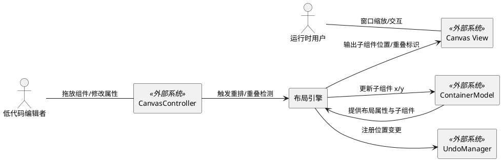
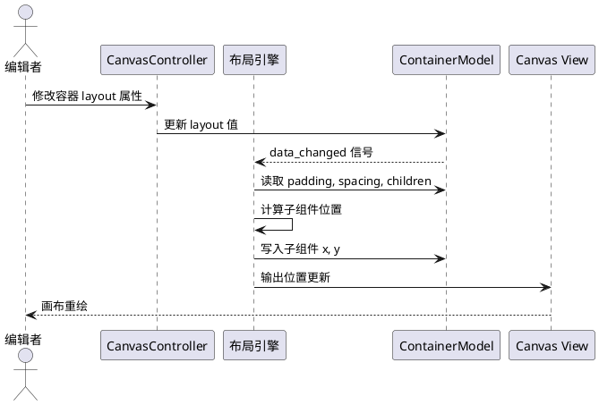
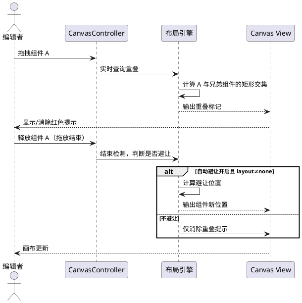
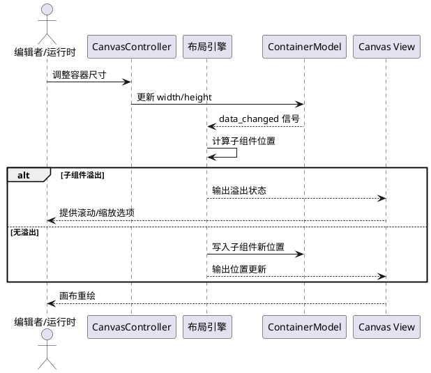
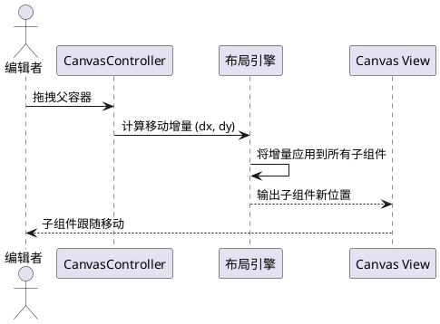

# **1. 组件定位**

## **1.1 核心职责**

本组件负责执行容器布局引擎的自动排列与重叠检测，实现画布中子组件按布局模式有序排列且不相互遮挡。

## **1.2 核心输入**

1. **容器布局属性变更**：用户在属性面板中修改容器的 layout、padding、spacing 值，或切换 position_mode
2. **子组件增删操作**：用户向容器中添加/移除子组件，触发布局重排
3. **子组件拖放操作**：用户在画布上拖拽子组件到新位置，触发重叠检测
4. **容器尺寸变更**：用户或系统改变容器宽高，触发子组件自适应重排
5. **父容器拖拽操作**：用户在编辑器中拖拽父容器，触发子组件联动移动

## **1.3 核心输出**

1. **子组件位置更新**：根据布局规则计算后的子组件坐标 (x, y)
2. **重叠视觉提示**：对重叠组件显示红色边框或半透明覆盖标识
3. **避让位置建议**：当启用自动避让时，返回被推组件的新坐标
4. **布局溢出状态**：当容器空间不足时，返回溢出标记和可选处理策略（滚动/缩放）
5. **联动移动信号**：父容器移动时，发出子组件跟随移动的增量坐标

## **1.4 职责边界**

1. 不负责子组件的渲染绘制（由 ContainerRenderer / ComponentRenderer 负责）
2. 不负责布局属性的数据持久化（由 ContainerModel 的序列化/反序列化负责）
3. 不负责画布交互事件的捕获（由 CanvasController / ComponentGraphicsItem 负责）
4. 不负责 grid 布局的列数/行高等高级配置（本阶段 grid 仅支持均匀网格）
5. 不负责跨容器的组件布局关系（每个容器的布局独立计算）

# **2. 领域术语**

**布局引擎 (Layout Engine)**
: 根据容器的布局模式、padding、spacing 属性，计算子组件在容器内部位置的规则执行器。

**布局模式 (Layout Mode)**
: 容器排列子组件的方向策略，取值为 none / vertical / horizontal / grid。
: 备注：none 表示绝对定位，子组件位置由用户手动设定。

**内边距 (Padding)**
: 容器内容区域与容器边界之间的距离，以像素为单位，四边等值。
: 备注：对应 ContainerModel.padding，默认 10px。

**子组件间距 (Spacing)**
: 布局模式下相邻子组件之间的距离，以像素为单位。
: 备注：对应 ContainerModel.spacing，默认 5px。

**重叠 (Overlap)**
: 两个组件的边界矩形存在交集区域的状态。

**避让 (Avoidance)**
: 将重叠组件移动到最近的空位，消除重叠的操作。

**溢出 (Overflow)**
: 子组件排列后超出容器内容区域的状态。

**布局重排 (Relayout)**
: 布局属性或子组件列表发生变化时，重新计算所有子组件位置的过程。

**绝对定位 (Absolute Positioning)**
: layout=none 时，子组件的位置由其 x、y 属性决定，不参与自动排列。

**内容区域 (Content Area)**
: 容器边界矩形扣除 padding 后的可用区域，子组件在此区域内排列。

# **3. 角色与边界**

## **3.1 核心角色**

- **低代码编辑者**：在画布编辑器中拖放组件、修改容器属性的开发者，是布局引擎的主要使用者
- **应用运行时用户**：在生成的应用界面中与容器交互的最终用户，受益于自适应布局

## **3.2 外部系统**

- **ContainerModel**：提供容器的 layout、padding、spacing、position_mode、width、height、children 等数据，是布局引擎的数据源
- **CanvasController**：捕获画布上的拖拽、缩放等交互事件，触发布局引擎的调用
- **Canvas View**：接收布局引擎输出的位置数据，更新画布上组件的视觉位置
- **UndoManager**：布局重排产生的位置变更需要支持撤销/重做

## **3.3 交互上下文**

# **4. DFX约束**

## **4.1 性能**

1. 布局重排计算响应时间不得超过 16ms（单帧），确保 60fps 画布流畅
2. 重叠检测响应时间不得超过 8ms，支持拖拽过程中实时反馈
3. 容器内子组件数量在 100 个以内时，重排计算不得超过 16ms

## **4.2 可靠性**

1. 布局重排不得丢失子组件（重排前后子组件数量一致）
2. 布局重排不得产生 NaN 或负无穷的坐标值
3. 布局属性变更与重排执行必须为原子操作，不允许出现中间状态对用户可见

## **4.3 安全性**

1. 布局引擎不得修改子组件的 width、height，仅修改 x、y
2. layout=none 时，布局引擎不得自动修改任何子组件位置

## **4.4 可维护性**

1. 布局引擎必须与渲染逻辑、交互逻辑解耦，可独立测试
2. 布局规则变更（如新增布局模式）不得影响已有模式的计算逻辑

## **4.5 兼容性**

1. 已有项目的 layout 默认值为 "none"，升级后必须保持绝对定位行为不变
2. 已有项目的 padding 默认值为 10、spacing 默认值为 5，升级后数值不变
3. 布局引擎的输出坐标必须与现有画布坐标系一致（左上角为原点）

# **5. 核心能力**

## **5.1 容器布局排列**

### **5.1.1 业务规则**

1. **垂直布局规则**：当容器 layout="vertical" 时，子组件必须按添加顺序从上到下排列，第一个子组件的顶部对齐内容区域顶部，后续子组件顶部与前一个子组件底部间距为 spacing，所有子组件左侧对齐内容区域左侧

   a. 验收条件：[容器 layout=vertical，padding=10，spacing=5，包含两个高度为 50 的子组件] → [第一个子组件 y=10，第二个子组件 y=65（10+50+5）]

2. **水平布局规则**：当容器 layout="horizontal" 时，子组件必须按添加顺序从左到右排列，第一个子组件的左侧对齐内容区域左侧，后续子组件左侧与前一个子组件右侧间距为 spacing，所有子组件顶部对齐内容区域顶部

   a. 验收条件：[容器 layout=horizontal，padding=10，spacing=5，包含两个宽度为 80 的子组件] → [第一个子组件 x=10，第二个子组件 x=95（10+80+5）]

3. **网格布局规则**：当容器 layout="grid" 时，子组件必须按均匀网格排列，列数由容器宽度自动计算（列数 = floor((容器宽度 - 2×padding + spacing) / (最小列宽 + spacing))），子组件按行优先顺序填入网格

   a. 验收条件：[容器 layout=grid，宽度=400，padding=10，spacing=5，最小列宽=120] → [列数=2，第一行放 2 个子组件，第二行放剩余子组件]

4. **绝对定位规则**：当容器 layout="none" 时，子组件位置必须保持其 x、y 属性值不变，布局引擎不干预

   a. 验收条件：[容器 layout=none，子组件 A 的 x=50, y=30] → [布局重排后子组件 A 的 x=50, y=30 不变]

5. **padding 参与计算规则**：内容区域必须为容器边界向内收缩 padding 像素后的矩形，子组件排列在内容区域内

   a. 验收条件：[容器 padding=20，x=100，y=100，width=400，height=300] → [内容区域起点 (120, 120)，尺寸 (360, 260)]

6. **spacing 参与计算规则**：布局模式下相邻子组件之间的间距必须等于 spacing 值

   a. 验收条件：[容器 layout=vertical，spacing=10，子组件 A 高度=50] → [下一个子组件 B 的 y = A.y + 50 + 10]

7. **布局切换触发重排**：当容器的 layout 属性值发生变化时，必须立即对所有子组件执行一次完整重排

   a. 验收条件：[容器从 layout=none 切换到 layout=vertical] → [子组件立即按垂直布局重新排列]

8. **子组件增删触发重排**：当容器新增或移除子组件时，若 layout 不为 none，必须立即重排

   a. 验收条件：[容器 layout=vertical，新增子组件 C] → [C 排列在最后一个子组件下方，原有子组件位置不变]

9. **禁止项**：布局重排不得修改子组件的 width 和 height

   a. 验收条件：[容器 layout=vertical，子组件 A 的 width=200, height=50] → [重排后 A 的 width=200, height=50 不变]

### **5.1.2 交互流程**

### **5.1.3 异常场景**

1. **容器无子组件**

   a. 触发条件：容器 children 为空列表时触发重排
   b. 系统行为：布局引擎正常执行，无计算对象，直接返回
   c. 用户感知：画布无变化，无错误提示

2. **子组件尺寸为零**

   a. 触发条件：子组件的 width 或 height 为 0
   b. 系统行为：仍参与排列计算，spacing 照常累加，但不占据可见空间
   c. 用户感知：后续子组件与零尺寸组件之间仅隔 spacing 像素

3. **布局属性值为非法值**

   a. 触发条件：layout 值不是 none/vertical/horizontal/grid
   b. 系统行为：回退为 layout=none，不执行重排
   c. 用户感知：子组件保持原位置，控制台输出警告日志

## **5.2 重叠检测与避让**

### **5.2.1 业务规则**

1. **拖放实时检测规则**：当用户在画布上拖拽组件时，布局引擎必须实时检测被拖组件与同容器内其他组件的边界矩形是否重叠

   a. 验收条件：[拖拽组件 A，A 的矩形与组件 B 的矩形有交集] → [立即标记 A 和 B 为重叠状态]

2. **重叠视觉提示规则**：当组件处于重叠状态时，必须显示红色虚线边框（线宽 2px）作为视觉提示

   a. 验收条件：[组件 A 与组件 B 重叠] → [A 和 B 均显示红色虚线边框]

3. **拖放结束消除提示**：当用户拖放操作结束后，若组件不再与其他组件重叠，必须立即消除重叠视觉提示

   a. 验收条件：[拖放结束，组件 A 不与任何组件重叠] → [A 的红色虚线边框消失]

4. **自动避让规则**：当启用自动避让选项且组件重叠时，布局引擎必须将后放置的组件沿布局方向推到最近的空位，使重叠消除

   a. 验收条件：[layout=vertical，组件 B 与组件 A 重叠，自动避让开启] → [B 被推到 A 下方，y = A.y + A.height + spacing]

5. **避让方向规则**：自动避让的推动方向必须与当前布局方向一致（vertical 向下推，horizontal 向右推，none/grid 向右优先，空间不足则向下）

   a. 验收条件：[layout=horizontal，组件 B 与 A 重叠] → [B 被推到 A 右侧，x = A.x + A.width + spacing]

6. **避让级联规则**：自动避让推动组件后，若推动后的组件与新的组件重叠，必须继续级联避让，直到无重叠

   a. 验收条件：[垂直布局中 A、B 紧密排列，拖入 C 与 B 重叠] → [B 被 C 推动下移，若 B 下移后与 D 重叠则 D 继续下移]

7. **layout=none 不自动避让**：当容器 layout="none" 时，仅提供重叠视觉提示，不执行自动避让

   a. 验收条件：[layout=none，组件重叠] → [显示红色提示，组件位置不变]

8. **禁止项**：重叠检测不得跨容器执行（只检测同容器内的兄弟组件）

   a. 验收条件：[组件 A 在容器 X 中，组件 B 在容器 Y 中] → [A 与 B 不进行重叠检测]

### **5.2.2 交互流程**

### **5.2.3 异常场景**

1. **所有方向空间不足**

   a. 触发条件：自动避让时容器内无足够空间放置被推组件
   b. 系统行为：组件溢出容器边界，标记溢出状态
   c. 用户感知：组件超出容器底部/右侧显示，容器出现溢出提示

2. **大量组件紧密排列导致级联避让链过长**

   a. 触发条件：级联避让涉及超过 20 个组件
   b. 系统行为：正常执行级联避让，但标记性能警告日志
   c. 用户感知：组件正常移位，无可见异常

3. **组件尺寸为零导致重叠误判**

   a. 触发条件：零尺寸组件的边界矩形为空，不产生实际重叠区域
   b. 系统行为：零尺寸组件不触发重叠检测
   c. 用户感知：零尺寸组件不显示重叠提示

## **5.3 容器 resize 子组件适应**

### **5.3.1 业务规则**

1. **resize 触发重排规则**：当容器的 width 或 height 发生变化时，若 layout 不为 none，必须立即对所有子组件执行重排

   a. 验收条件：[容器 layout=horizontal，宽度从 400 缩小到 300] → [子组件按新宽度重新排列，可能产生溢出]

2. **溢出滚动选项规则**：当子组件排列后超出容器内容区域时，必须提供滚动选项，允许用户通过滚动查看溢出内容

   a. 验收条件：[垂直布局中子组件总高度超过容器内容区域高度] → [容器支持纵向滚动]

3. **溢出缩放选项规则**：当子组件超出容器内容区域时，可选提供缩放选项，按比例缩小子组件以适应容器

   a. 验收条件：[启用缩放选项，子组件超出容器] → [子组件按容器内容区域与总需求区域的比例缩小]

4. **layout=none 不响应 resize**：当容器 layout="none" 时，容器尺寸变化不得自动移动子组件

   a. 验收条件：[layout=none，容器宽度从 400 变为 500] → [子组件位置不变]

### **5.3.2 交互流程**

### **5.3.3 异常场景**

1. **容器尺寸缩为零**

   a. 触发条件：容器 width 或 height 被设为 0
   b. 系统行为：所有子组件标记为溢出，不执行重排
   c. 用户感知：子组件保持在原位，容器显示溢出状态

2. **缩放比例低于最小阈值**

   a. 触发条件：缩放选项计算出的缩放比例低于 0.3
   b. 系统行为：不执行缩放，改为启用滚动
   c. 用户感知：子组件保持原始尺寸，容器提供滚动条

## **5.4 父容器拖拽联动**

### **5.4.1 业务规则**

1. **联动移动规则**：在编辑器中拖拽父容器时，所有子组件必须跟随父容器同步移动，保持相对位置不变

   a. 验收条件：[父容器从 (100,100) 拖拽到 (150,130)，子组件 A 原位置 (110,110)] → [子组件 A 移动到 (160,140)]

2. **联动仅限编辑器**：联动移动仅在编辑器画布中生效，运行时由布局引擎控制位置

   a. 验收条件：[运行时模式下拖拽父容器] → [子组件由布局引擎重排决定位置，不直接跟随拖拽]

3. **禁止项**：子组件跟随移动不得修改子组件相对于父容器的偏移量

   a. 验收条件：[联动移动后，子组件 A 的 (x - parent.x) 和 (y - parent.y) 与移动前一致]

### **5.4.2 交互流程**

### **5.4.3 异常场景**

1. **父容器无子组件**

   a. 触发条件：拖拽的父容器 children 为空
   b. 系统行为：正常移动父容器自身，无子组件需联动
   c. 用户感知：父容器单独移动，无异常

2. **子组件已被锁定**

   a. 触发条件：子组件被标记为 locked（禁止移动）
   b. 系统行为：锁定子组件不参与联动移动，保持原位
   c. 用户感知：父容器移动，锁定子组件不跟随

# **6. 数据约束**

## **6.1 ContainerModel（容器模型）**

1. **layout**：取值范围 ["none", "vertical", "horizontal", "grid"]，默认值 "none"
2. **padding**：整数，取值范围 [0, 200]，默认值 10，单位 px
3. **spacing**：整数，取值范围 [0, 200]，默认值 5，单位 px
4. **position_mode**：取值范围 ["absolute", "center"]，默认值 "center"
5. **width**：整数，取值范围 [1, 10000]，单位 px
6. **height**：整数，取值范围 [1, 10000]，单位 px
7. **children**：子组件 ID 列表，有序，允许为空

## **6.2 LayoutResult（布局计算结果）**

1. **positions**：字典，key 为子组件 ID，value 为 (x, y) 坐标元组
2. **overlaps**：列表，每项为两个重叠子组件 ID 的元组 (comp_id_a, comp_id_b)
3. **overflow**：布尔值，表示子组件是否溢出容器内容区域
4. **content_area**：元组 (x, y, width, height)，表示容器内容区域矩形

## **6.3 OverlapInfo（重叠信息）**

1. **source_id**：被拖拽组件的 ID，必填
2. **target_id**：重叠对方组件的 ID，必填
3. **intersection_rect**：交集矩形 (x, y, width, height)，width > 0 且 height > 0
4. **avoidance_position**：可选，避让后组件的目标坐标 (x, y)
